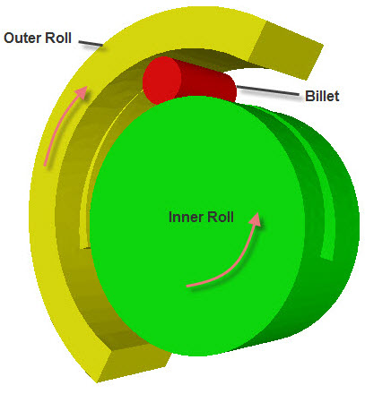

<!DOCTYPE html>
<html lang="en">
<head>
    
</head>

<body>

<!-- Main heading of the experiment -->
<h1>Transverse Wedge Rolling</h1>

<!-- Introduction paragraph -->

Transverse Wedge Rolling is a metal forming process in which a round billet is inserted
between appropriately shaped rolls or flat plates that deform the workpiece as it rotates.
These tools incorporate a wedge-shaped profile, from which the process takes its name.

<!-- Explanation of different process configurations -->

There are several versions of the Transverse Wedge Rolling process, depending on the type
of tooling and motion involved.

<!-- List of different configurations -->
<ul>
    <li>
        If rolls are used, they rotate in the same direction and drive the workpiece.
        In this case, either two or three rolls can be used.
    </li>
    <li>
        If flat tools are used, they move in opposite directions while rotating the
        workpiece between them.
    </li>
    <li>
        A planetary system with a single large work roll and a fixed work segment is also
        possible. In addition, concave tooling segments can be used.
    </li>
</ul>

<!-- Description related to planetary rolling -->

In the planetary rolling configuration, a large rotating roll works together with fixed
or concave tooling segments to progressively deform the billet as it rotates. This setup
allows continuous deformation and improved material flow.

<!-- Description related to three-roll system -->

In the three-roll Transverse Wedge Rolling system, three rolls surround the billet and
rotate simultaneously. The wedge-shaped profiles on the rolls deform the billet uniformly
as it rotates, producing the desired shape.

<!-- End of theory content -->
</body>
</html>
